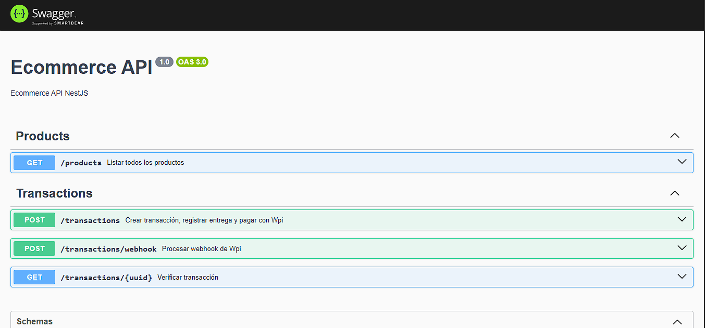
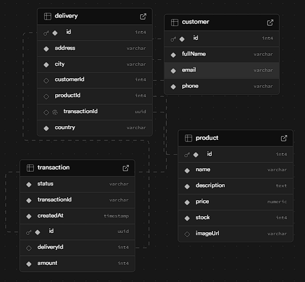

# API de E-commerce con NestJS

API RESTful para gestión de productos de e-commerce construida con NestJS, TypeORM y PostgreSQL, con integración de pagos WPI.

## 📸 Capturas de Pantalla

### Documentación API (Swagger UI)


### Esquema de Base de Datos


## 🚀 Características

- **Gestión de Productos**: CRUD completo con control de stock
- **Sistema de Transacciones**: Procesamiento de pagos con WPI
- **Gestión de Entregas**: Tracking de envíos y clientes
- **Webhooks**: Integración con servicios de pago
- **Documentación API**: Swagger UI integrado
- **Pruebas Unitarias**: 90%+ de cobertura de código
- **Validación de Datos**: DTOs con validaciones robustas
- **Manejo de Errores**: Excepciones personalizadas

## 📋 Prerrequisitos

- Node.js (v18 o superior)
- PostgreSQL
- npm o yarn
- Integracion con WPI para procesamiento de pagos

## 🛠️ Instalación

### 1. Clonar el repositorio

```bash
git clone <url-del-repositorio>
cd ecommerce-api-nestjs
```

### 2. Instalar dependencias

```bash
npm install
```

### 3. Configurar variables de entorno

Crear archivo `.env` en la raíz del proyecto:

```env
# Base de datos
DB_HOST=localhost
DB_PORT=5432
DB_USERNAME=postgres
DB_PASSWORD=tu_password
DB_DATABASE=ecommerce_db

# WPI Configuration
WPI_PUBLIC_KEY=tu_public_key
WPI_SECRET_KEY=tu_secret_key
WPI_BASE_URL=https://api.wpi.com
WPI_INTEGRITY_KEY=tu_integrity_key

# Aplicación
PORT=3000
NODE_ENV=development
```

### 4. Configurar base de datos

```bash
# Crear la base de datos PostgreSQL
createdb ecommerce_db

# Ejecutar migraciones (si las tienes configuradas)
npm run migration:run

# Crear productos de prueba
npx ts-node src/database/seed.ts
```

### 5. Iniciar el servidor

```bash
# Desarrollo
npm run start:dev

# Producción
npm run start:prod

# Debug
npm run start:debug
```

## 🧪 Pruebas Unitarias

### Ejecutar Pruebas

```bash
# Ejecutar todas las pruebas
npm test

# Ejecutar pruebas con cobertura
npm run test:cov

# Ejecutar pruebas en modo watch
npm run test:watch

# Generar reporte HTML de cobertura
npm run test:cov:html

# Ejecutar pruebas de integración
npm run test:e2e
```

### Cobertura de Pruebas

- **Statements**: 90.22% ✅
- **Branches**: 85.18% ✅
- **Functions**: 84.61% ✅
- **Lines**: 90.38% ✅

### Estructura de Pruebas

```
src/
├── products/
│   ├── product.service.spec.ts
│   ├── product.controller.spec.ts
│   ├── product.module.spec.ts
│   └── product.entity.spec.ts
├── transactions/
│   ├── transaction.service.spec.ts
│   ├── transaction.controller.spec.ts
│   ├── transaction.module.spec.ts
│   ├── wpi.service.spec.ts
│   ├── transaction.entity.spec.ts
│   └── dto/create-transaction.dto.spec.ts
└── app.module.spec.ts
```

## 🔧 Configuración

### CORS (Cross-Origin Resource Sharing)

La aplicación está configurada para permitir peticiones desde diferentes orígenes. La configuración se encuentra en `main.ts`:

```typescript
app.enableCors({
  origin: true, // Permite todos los orígenes en desarrollo
  credentials: true,
  methods: ['GET', 'POST', 'PUT', 'DELETE', 'PATCH'],
  allowedHeaders: ['Content-Type', 'Authorization'],
});
```

Para producción, se recomienda configurar orígenes específicos:

```typescript
app.enableCors({
  origin: ['https://tu-dominio.com', 'https://admin.tu-dominio.com'],
  credentials: true,
});
```

### TypeORM Configuration

```typescript
TypeOrmModule.forRoot({
  type: 'postgres',
  host: process.env.DB_HOST,
  port: parseInt(process.env.DB_PORT),
  username: process.env.DB_USERNAME,
  password: process.env.DB_PASSWORD,
  database: process.env.DB_DATABASE,
  entities: [__dirname + '/**/*.entity{.ts,.js}'],
  synchronize: process.env.NODE_ENV === 'development',
  logging: process.env.NODE_ENV === 'development',
})
```

## 📚 Documentación API

### Swagger UI

- **URL**: `http://localhost:3000/api-docs`
- **Especificación**: `http://localhost:3000/api-json`

#### Documentación Interactiva


La imagen muestra la interfaz de Swagger UI con la documentación interactiva de la API.

### Endpoints Principales

#### Productos

```http
GET    /products              # Listar todos los productos
GET    /products/:id          # Obtener producto por ID
```

#### Transacciones

```http
POST   /transactions          # Crear nueva transacción
GET    /transactions/:uuid    # Verificar estado de transacción
POST   /transactions/webhook  # Webhook de WPI
```

### Ejemplo de Crear Transacción

```json
POST /transactions
{
  "amount": 1500,
  "card": {
    "number": "4111111111111111",
    "cvc": "123",
    "exp_month": "12",
    "exp_year": "2025",
    "card_holder": "Juan Pérez"
  },
  "delivery": {
    "productId": 1,
    "address": "Calle 123 #45-67",
    "city": "Bogotá",
    "country": "Colombia",
    "customer": {
      "fullName": "Juan Pérez",
      "email": "juan@example.com",
      "phone": "3001234567"
    }
  }
}
```

## 🏗️ Estructura del Proyecto

```
src/
├── app.module.ts                 # Módulo principal
├── main.ts                       # Punto de entrada
├── products/                     # Módulo de productos
│   ├── product.controller.ts
│   ├── product.service.ts
│   ├── product.module.ts
│   ├── product.entity.ts
│   └── dto/
│       └── product.dto.ts
├── transactions/                 # Módulo de transacciones
│   ├── transaction.controller.ts
│   ├── transaction.service.ts
│   ├── transaction.module.ts
│   ├── transaction.entity.ts
│   ├── wpi.service.ts
│   └── dto/
│       ├── create-transaction.dto.ts
│       ├── card.dto.ts
│       └── transaction-wpi.dto.ts
├── customers/                    # Entidad de clientes
│   └── customer.entity.ts
├── deliveries/                   # Entidad de entregas
│   ├── delivery.entity.ts
│   └── dto/
│       └── create-delivery.dto.ts
└── database/
    └── seed.ts                   # Datos de prueba
```

## 🔒 Seguridad

### Validaciones

- **Monto mínimo**: $1.500 COP
- **Nombre del titular**: Mínimo 5 caracteres
- **Stock disponible**: Verificación antes de la transacción
- **Validación de tarjetas**: Integración con WPI

### Manejo de Errores

```typescript
// Errores personalizados
throw new BadRequestException('El monto mínimo permitido es de $1.500 COP');
throw new NotFoundException('El producto seleccionado no está disponible');
```

## 🚀 Despliegue

### Variables de Entorno de Producción

```env
NODE_ENV=production
PORT=3000
DB_HOST=tu-host-produccion
DB_PORT=5432
DB_USERNAME=tu-usuario
DB_PASSWORD=tu-password-seguro
DB_DATABASE=ecommerce_prod
WPI_PUBLIC_KEY=tu-public-key-produccion
WPI_SECRET_KEY=tu-secret-key-produccion
WPI_BASE_URL=https://api.wpi.com
WPI_INTEGRITY_KEY=tu-integrity-key-produccion
```

### Comandos de Despliegue

```bash
# Construir para producción
npm run build

# Iniciar en producción
npm run start:prod
```


### Base de datos 

Base de datos en supabase: https://supabase.com/

#### Esquema de Base de Datos


La imagen muestra la estructura de las tablas y relaciones en la base de datos PostgreSQL.
